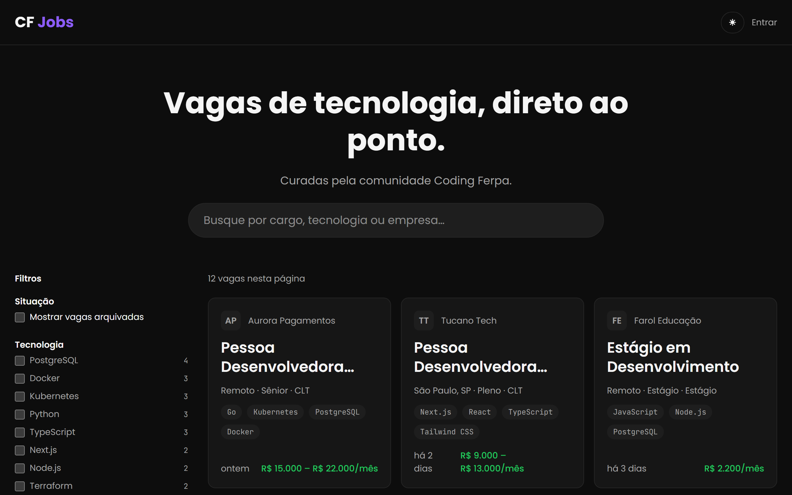

# CF Jobs

[](https://github.com/Coding-Ferpa/cf-jobs/actions/workflows/ci.yml)
[](LICENSE)
[](https://github.com/Coding-Ferpa/cf-jobs/issues?q=is%3Aissue+is%3Aopen+label%3A%22good+first+issue%22)

Plataforma **open source** de vagas de tecnologia da comunidade [Coding Ferpa](https://codingferpa.org/) — _Além do código_.

Centraliza vagas em um único lugar com busca, filtros inteligentes e páginas otimizadas para SEO. O cadastro é feito colando apenas a **URL oficial da vaga**: o sistema extrai o conteúdo e usa IA (NVIDIA NIM) para classificar e preencher tudo automaticamente, com revisão humana antes de publicar.



## Status

🚧 **Em construção.** A fundação do repositório está pronta: app, design system, testes e CI. O banco de dados, a área pública e o pipeline de importação vêm nos próximos milestones — o plano completo está no [doc 14](docs/14-prompt-de-execucao-opus-5.md).

## Stack

Next.js 16 (App Router) · TypeScript estrito · Tailwind CSS v4 + shadcn/ui · Drizzle ORM · Supabase (Postgres + Auth) · NVIDIA NIM · Vercel

O porquê de cada escolha está em [docs/01 — Stack](docs/01-stack.md).

## Quickstart

Requisitos: **Node 24+** (mínimo 24.15), **pnpm**, **Git** e **Docker** (para o Supabase local).

```bash
git clone git@github.com:Coding-Ferpa/cf-jobs.git
cd cf-jobs
pnpm install
cp .env.example .env
pnpm db:start
pnpm dev
```

`pnpm db:start` sobe o Postgres local, aplica as migrations e carrega as taxonomias do seed; ele imprime a `DATABASE_URL` e as chaves para preencher o `.env`. Abra <http://localhost:3000>.

Contas de desenvolvimento, uma por papel (existem apenas no seed local, senha `cfjobs-local`): `admin@cfjobs.local`, `editor@cfjobs.local`, `moderator@cfjobs.local`, `reader@cfjobs.local`.

Bateria de qualidade:

```bash
pnpm lint && pnpm typecheck && pnpm test
```

Os testes de integração precisam do Supabase local no ar (`pnpm db:start`):

```bash
pnpm test:integration
```

## API pública

Leitura de vagas e taxonomias, aberta e sem chave — é o que alimenta integrações da comunidade, como o bot do Discord. A referência navegável fica em `/api/v1/docs` e o contrato em `/api/v1/openapi.json` (OpenAPI 3.1 gerado dos mesmos schemas Zod dos handlers).

```bash
curl "http://localhost:3000/api/v1/jobs?tech=go&limit=5"
```

## Documentação

A especificação técnica completa vive em [`docs/`](docs/README.md) e é a fonte da verdade do projeto.

|                                                                                                                                                       |                                                                                                                                                      |
| ----------------------------------------------------------------------------------------------------------------------------------------------------- | ---------------------------------------------------------------------------------------------------------------------------------------------------- |
| [Visão geral](docs/00-visao-geral.md) · [Stack](docs/01-stack.md) · [Arquitetura](docs/02-arquitetura.md) · [Design System](docs/03-design-system.md) | [Banco de dados](docs/04-banco-de-dados.md) · [Pipeline de IA](docs/05-pipeline-ia.md) · [APIs](docs/06-apis.md) · [Segurança](docs/07-seguranca.md) |
| [Frontend & SEO](docs/08-frontend-seo.md) · [Analytics](docs/09-analytics-observabilidade.md) · [Escalabilidade](docs/10-escalabilidade.md)           | [Open Source](docs/11-open-source.md) · [Qualidade](docs/12-qualidade.md) · [Roadmap](docs/13-roadmap.md)                                            |

## Contribuindo

Toda contribuição é bem-vinda — comece pelo [CONTRIBUTING.md](CONTRIBUTING.md) e pelas issues marcadas como `good first issue`. O projeto segue o [Código de Conduta](CODE_OF_CONDUCT.md).

Encontrou uma vulnerabilidade? Não abra issue pública: siga o [SECURITY.md](SECURITY.md).

## Licença

[MIT](LICENSE)
