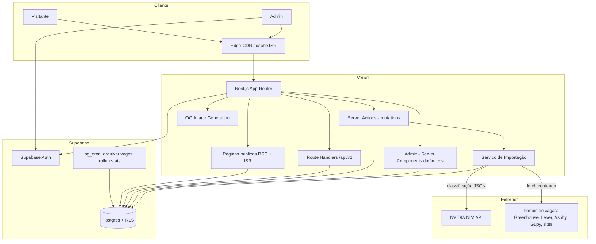
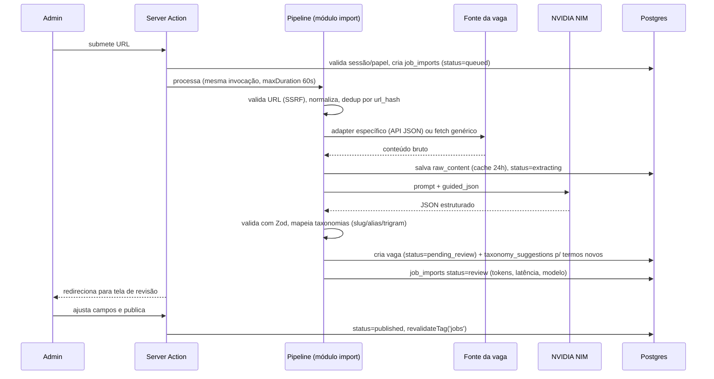

# 02 — Arquitetura do Sistema

## Visão de componentes



Não há serviços separados: **um único app Next.js** contém área pública, admin, API pública e o serviço de importação (módulo interno executado em Server Actions/Route Handlers com runtime Node). O Supabase concentra dados, auth e agendamento. Essa topologia minimiza custo (2 serviços gratuitos), deploy (1 pipeline) e onboarding (1 repo, 1 `pnpm dev`).

## Fluxos principais

### 1. Visitante busca vagas

1. Request chega à CDN da Vercel; homepage e páginas de vaga são servidas do cache ISR (HIT na maioria dos acessos — TTFB ~50ms).
2. Filtros alteram a URL (`/?tech=react&modalidade=remoto`); a listagem é um Server Component que consulta o Postgres (índices GIN/tsvector) e renderiza no servidor. Paginação via cursor.
3. Ao abrir uma vaga, um beacon (`POST /api/v1/events`) registra `job_view` — inserção direta em `job_events` com RLS de insert-only.

### 2. Admin importa vaga por URL (fluxo central do produto)



Decisões deste fluxo:
- **Mesma invocação, resposta imediata (revisado pós-M6).** A medição real derrubou a premissa original de 5–20s: no tier gratuito do NIM a latência é de fila, imprevisível (28–129s medidos nas 4 importações reais). A action cria o `job_imports` e **dispara o pipeline em segundo plano na mesma invocação** (`after()`/`waitUntil`), retornando na hora; a UI acompanha por polling (GET dedicado — Server Actions do mesmo cliente são serializadas pelo Next). A rota de importação declara `maxDuration: 300` (Fluid compute, disponível no plano Hobby). Falha além do teto permanece retomável do cache ("Tentar novamente"). Continua **sem fila externa**; a fila em Postgres da Fase 2 (ver [doc 05](05-pipeline-ia.md#importação-em-lote)) segue reservada para lote.
- **Tudo auditável.** Cada tentativa vira uma linha em `job_imports` com timing, tokens, modelo, erro — alimenta o dashboard de observabilidade sem ferramenta extra.
- **Human-in-the-loop.** A vaga nasce `pending_review`; publicar é ação humana explícita no MVP.

### 3. Ciclo de vida da vaga

```
draft → pending_review → published → archived
                       ↘ rejected
```

- `published_at` marcado na publicação; `expires_at = published_at + 30 dias` (editável pelo admin para vagas com prazo próprio).
- **Job diário do pg_cron** (03:00 UTC): `UPDATE jobs SET status='archived', archived_at=now() WHERE status='published' AND expires_at < now()`; em seguida chama a Vercel via `pg_net` para `revalidateTag('jobs')` (endpoint protegido por `CRON_SECRET`).
- Vaga arquivada: página continua no ar (SEO preservado, aviso "expirada", `JobPosting.validThrough` no passado), some da listagem padrão, aparece com filtro "arquivadas".

## Estrutura de pastas do repositório

```
cfjobs/
├── docs/                       # esta documentação + ADRs
│   └── adr/                    # ADR-0001..., template incluso
├── public/
├── src/
│   ├── app/
│   │   ├── (public)/           # layout público
│   │   │   ├── page.tsx        # homepage = listagem + filtros
│   │   │   ├── vagas/[slug]/page.tsx
│   │   │   ├── vagas/[slug]/opengraph-image.tsx
│   │   │   ├── empresas/[slug]/page.tsx      # fase 2
│   │   │   ├── sobre/page.tsx
│   │   │   ├── sitemap.ts
│   │   │   └── robots.ts
│   │   ├── (auth)/login/page.tsx
│   │   ├── admin/              # layout com guard de papel
│   │   │   ├── page.tsx        # dashboard
│   │   │   ├── vagas/          # lista, editar, importar, revisar
│   │   │   ├── taxonomias/     # CRUDs auxiliares + fila de sugestões
│   │   │   └── importacoes/    # logs
│   │   └── api/
│   │       ├── v1/             # API pública versionada
│   │       │   ├── jobs/route.ts
│   │       │   ├── jobs/[slug]/route.ts
│   │       │   ├── taxonomies/route.ts
│   │       │   ├── events/route.ts
│   │       │   └── openapi/route.ts
│   │       └── internal/revalidate/route.ts   # chamado pelo pg_cron
│   ├── components/
│   │   ├── ui/                 # shadcn/ui (gerado, editável)
│   │   ├── jobs/               # JobCard, JobFilters, JobDetail...
│   │   └── admin/
│   ├── db/
│   │   ├── schema/             # Drizzle schema por domínio
│   │   ├── queries/            # funções de leitura tipadas
│   │   └── client.ts
│   ├── features/
│   │   └── import/             # pipeline de importação
│   │       ├── adapters/       # greenhouse.ts, lever.ts, ashby.ts, gupy.ts, generic.ts
│   │       ├── extract.ts      # JSON-LD, readability, markdown
│   │       ├── classify.ts     # chamada NIM + validação
│   │       ├── map-taxonomies.ts
│   │       └── pipeline.ts     # orquestração + máquina de estados
│   ├── lib/                    # env, auth helpers, utils, rate-limit
│   └── actions/                # Server Actions por domínio
├── supabase/
│   ├── migrations/             # SQL: schema + RLS + triggers + cron
│   ├── seed.sql                # taxonomias pré-populadas
│   └── config.toml
├── e2e/                        # Playwright
├── .github/                    # workflows, templates
└── (configs raiz)
```

Racional: **organização por feature no que é complexo** (`features/import`), por tipo no que é simples. O pipeline de importação é o coração do sistema e fica isolado, testável sem Next.js (funções puras que recebem/retornam dados — os testes unitários rodam contra fixtures de HTML real).

## Camadas e regras de dependência

```
app/ (rotas, RSC)  →  actions/  →  features/, db/queries  →  db/schema, lib/
components/        →  lib/ (nunca importa db/ diretamente)
```

- Componentes nunca acessam o banco; recebem dados por props de Server Components.
- Server Actions são a única porta de escrita do admin; toda action: valida sessão → valida input (Zod) → autoriza (papel) → executa → audita → `revalidateTag`.
- `features/import` não conhece Next.js (sem imports de `next/*`) — princípio de Clean Architecture aplicado **apenas aqui**, onde há lógica de domínio real. Não criaremos camadas hexagonais no CRUD; seria complexidade sem retorno.

## Decisões transversais

| Tema | Decisão |
|---|---|
| Slugs de vaga | `{titulo-kebab}-{empresa-kebab}-{id6}` (6 chars do UUID base36). Únicos, legíveis, sem colisão, imunes a renomeação de título (redirect 301 se slug mudar) |
| Timezone | Tudo em UTC no banco; exibição em `America/Sao_Paulo` |
| Idiomas | UI pt-BR; conteúdo da vaga preserva idioma original (`language` na vaga) |
| Imagens OG | Geradas por rota `opengraph-image.tsx` (ImageResponse) com título, empresa, senioridade, modalidade e identidade visual da comunidade |
| Erros | `error.tsx` por segmento; erros de import nunca derrubam a página — sempre capturados e gravados em `job_imports` |
| Mensagens de validação | pt-BR em todo o app: `z.config(z.locales.pt())` global no bootstrap (Zod 4); mensagens manuais apenas onde precisarem ser mais específicas que o locale (decisão pós-M5). Na implementação a chamada mora em `lib/zod.ts`, que reexporta o `z` configurado — no `instrumentation.ts` ela não alcança a instância das rotas ([ADR-0016](adr/0016-locale-do-zod-no-modulo-e-nao-no-bootstrap.md)) |
| Feature flags | Não no MVP; fases futuras entram por PR normal |
