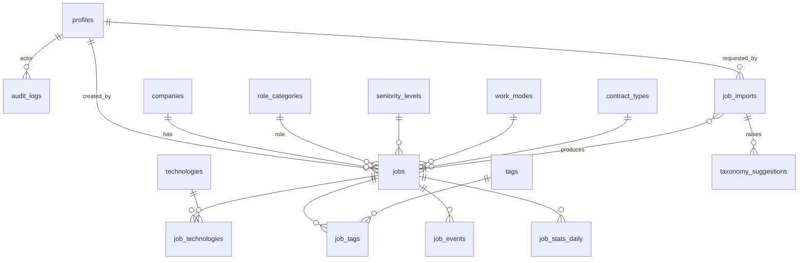

# 04 — Banco de Dados (Supabase Postgres)

## Princípios de modelagem

1. **Enums de sistema vs. tabelas de domínio.** Estados internos imutáveis (status de vaga, status de importação, papéis) são `ENUM` Postgres — não fazem sentido em CRUD. Já os **cadastros auxiliares que o admin gerencia e a IA seleciona** (tecnologias, cargos, modalidades, tipos de contratação, senioridades, tags) são **tabelas de lookup** com `slug`, `label`, `aliases` e `is_active`: o requisito exige CRUD administrativo e a IA precisa de listas dinâmicas para mapear.
2. **Uma tabela `technologies` com coluna `kind`** em vez de tabelas separadas para linguagens/frameworks/bancos/cloud/ferramentas. Motivo: o comportamento é idêntico (M:N com vaga, filtro, chip), a fronteira entre categorias é fluida (TypeScript é linguagem e ferramenta de todo framework) e a IA classifica melhor contra uma lista única. `kind` preserva a distinção para filtros.
3. **Soft state, nunca delete físico de vagas** — `status` + `archived_at`. URLs são permanentes (SEO).
4. **Todo dado de observabilidade nasce no banco** (`job_imports`, `job_events`) — o dashboard não depende de ferramenta externa.

## ERD

## Enums (sistema)

| Enum | Valores |
|---|---|
| `user_role` | `admin`, `editor`, `moderator`, `reader` |
| `job_status` | `draft`, `pending_review`, `published`, `archived`, `rejected` |
| `import_status` | `queued`, `fetching`, `extracting`, `classifying`, `mapping`, `review`, `completed`, `failed` |
| `technology_kind` | `language`, `framework`, `database`, `cloud`, `tool` |
| `salary_period` | `hour`, `month`, `year` |
| `event_type` | `view`, `click_apply`, `share` |
| `suggestion_status` | `pending`, `approved`, `rejected`, `merged` |

## Tabelas

### `profiles` (espelho de `auth.users`)
| Coluna | Tipo | Regras |
|---|---|---|
| `id` | uuid PK | FK `auth.users(id)` on delete cascade |
| `display_name` | text | not null |
| `avatar_url` | text | null |
| `role` | user_role | not null default `reader` |
| `created_at` / `updated_at` | timestamptz | default now() |

Criada por **trigger** `on_auth_user_created` (function `handle_new_user()` security definer) ao registrar usuário. O papel também é injetado no JWT via **Custom Access Token Auth Hook** (function `custom_access_token`), permitindo checar papel sem query extra ([doc 07](07-seguranca.md)).

### `companies`
`id` uuid PK default `gen_random_uuid()` · `name` text not null · `slug` text **unique** not null · `website` text · `logo_url` text · `description` text · `created_at`/`updated_at`. Unicidade case-insensitive: unique index em `lower(name)`. A IA cria empresas automaticamente (match por `lower(name)` antes de inserir).

### `jobs` (núcleo)
| Coluna | Tipo | Regras |
|---|---|---|
| `id` | uuid PK | default gen_random_uuid() |
| `slug` | text | unique not null — `{titulo}-{empresa}-{6 chars}` |
| `title` | text | not null, check `length(title) between 3 and 200` |
| `company_id` | uuid | FK companies, not null |
| `description_md` | text | not null — Markdown sanitizado |
| `summary` | text | resumo de 1–2 frases gerado pela IA (cards, meta description) |
| `role_category_id` | uuid | FK role_categories, null se IA incerta |
| `seniority_id` | uuid | FK seniority_levels, null |
| `work_mode_id` | uuid | FK work_modes, null |
| `contract_type_id` | uuid | FK contract_types, null |
| `location_city` / `location_state` / `location_country` | text | null; country ISO-3166 alpha-2 |
| `salary_min` / `salary_max` | numeric(12,2) | check `salary_max >= salary_min` |
| `salary_currency` | char(3) | ISO-4217 (`BRL`, `USD`…) |
| `salary_period` | salary_period | default `month` |
| `benefits` | text[] | default `{}` |
| `keywords` | text[] | default `{}` — SEO/busca |
| `language` | text | BCP-47 (`pt-BR`, `en`), default `pt-BR` |
| `source_url` | text | not null — URL oficial da vaga |
| `source_url_hash` | text | **unique** — sha256 da URL canônica (dedup) |
| `source_site` | text | ex.: `greenhouse`, `lever`, `gupy`, `generic` |
| `apply_url` | text | not null (pode = source_url) |
| `status` | job_status | not null default `draft` |
| `published_at` / `expires_at` / `archived_at` | timestamptz | `expires_at` default publicação + 30d (trigger) |
| `views_count` / `clicks_count` | integer | default 0 — denormalizado, atualizado pelo rollup diário |
| `search` | tsvector | **generated always** de title + summary + company name (via trigger, config `portuguese` + fallback `simple`) |
| `created_by` | uuid | FK profiles |
| `created_at` / `updated_at` | timestamptz | trigger `set_updated_at` |

### Lookups: `role_categories`, `seniority_levels`, `work_modes`, `contract_types`, `technologies`, `tags`
Estrutura comum: `id` uuid PK · `slug` text unique · `label` text · `aliases` text[] (para matching da IA: ex. tecnologia `postgresql` com aliases `{postgres, pgsql}`) · `is_active` boolean default true · `sort_order` int · `created_at`. Específicos: `technologies.kind technology_kind not null`; `seniority_levels.rank int` (ordenação Estágio→Principal).

### Junções: `job_technologies`, `job_tags`
`(job_id, technology_id|tag_id)` PK composta, FKs on delete cascade. `job_technologies.is_primary boolean default false` (até 3 tecnologias principais destacadas no card).

### `job_imports` (fila + auditoria do pipeline)
| Coluna | Tipo | Notas |
|---|---|---|
| `id` uuid PK · `url` text · `url_hash` text | | index para dedup/cache |
| `status` | import_status | máquina de estados do [doc 05](05-pipeline-ia.md) |
| `source_site` | text | adapter detectado |
| `raw_content` | text | conteúdo extraído (cache 24h; limpo por cron após 7 dias) |
| `ai_response` | jsonb | JSON bruto validado da IA |
| `error_step` / `error_message` | text | null quando sucesso |
| `model` | text | modelo NIM usado |
| `tokens_in` / `tokens_out` | int | do usage da API |
| `latency_ms` | int | tempo total do pipeline |
| `attempt` | int | default 1 |
| `job_id` | uuid FK jobs | null até criar a vaga |
| `requested_by` | uuid FK profiles | |
| `created_at` / `finished_at` | timestamptz | |

### `taxonomy_suggestions` (fila de revisão humana)
`id` uuid PK · `kind` text (`technology`, `tag`, `role_category`…) · `suggested_label` text · `normalized_slug` text · `context` text (trecho da vaga que originou) · `import_id` FK · `status` suggestion_status default `pending` · `resolved_taxonomy_id` uuid (quando aprovada ou mesclada a existente) · `reviewed_by` FK profiles · `created_at`/`reviewed_at`. Unique parcial em `(kind, normalized_slug) where status='pending'` — evita duplicar sugestão pendente.

### `job_events` (analytics first-party)
`id` bigint identity PK · `job_id` uuid FK · `event_type` event_type · `occurred_at` timestamptz default now() · `occurred_on` date (materializada no insert — o dedup diário do doc 06 precisa do dia em índice e a conversão de fuso não é imutável) · `referrer` text · `utm_source` text · `visitor_hash` text (sha256 de IP+UA+dia com salt — **anônimo, LGPD-friendly**, sem IP bruto). Sem FK para profiles: eventos são anônimos por design. Projetada para particionamento futuro por mês ([doc 10](10-escalabilidade.md)).

### `job_stats_daily` (agregado)
`job_id` uuid FK · `day` date · `views` int · `clicks` int · `shares` int · PK `(job_id, day)`. Populada pelo rollup noturno; alimenta dashboard e `views_count` da vaga.

### `audit_logs`
`id` bigint identity · `actor_id` FK profiles · `action` text (`job.publish`, `taxonomy.approve`…) · `entity` text · `entity_id` uuid · `diff` jsonb (antes/depois dos campos alterados) · `created_at`. Insert-only (sem update/delete via RLS).

## Índices

| Tabela | Índice | Motivo |
|---|---|---|
| jobs | `(status, published_at desc)` parcial `where status='published'` | listagem padrão |
| jobs | GIN em `search` | busca full-text |
| jobs | GIN em `keywords` | busca por keyword |
| jobs | `(company_id)`, `(role_category_id)`, `(seniority_id)`, `(work_mode_id)`, `(contract_type_id)` | filtros |
| jobs | `(expires_at)` parcial `where status='published'` | job de arquivamento |
| job_technologies | `(technology_id, job_id)` | filtro por tecnologia (ordem invertida da PK) |
| job_tags | `(tag_id, job_id)` | idem |
| job_events | `(job_id, occurred_at)` | rollup |
| job_events | BRIN em `occurred_at` | varreduras temporais baratas |
| job_imports | `(url_hash, created_at desc)` | cache/dedup |
| todas lookups | unique em `slug`; GIN em `aliases` | matching da IA |
| extensão | `pg_trgm` + GIN trigram em `technologies.label`, `tags.label`, `companies.name` | fuzzy match da IA e autocomplete |

## Views e Materialized Views

- **View `active_jobs`**: `select * from jobs where status='published'` — conveniência para queries públicas e para a API.
- **View `v_dashboard_summary`**: totais (vagas por status, imports por status, médias de latência/tokens) — dashboard lê uma view, não 8 queries.
- **Materialized View `mv_facet_counts`** *(criada apenas na Fase de escala, ver doc 10)*: contagem de vagas ativas por tecnologia/cargo/senioridade/modalidade para os facet counts dos filtros. No MVP (< 10k vagas) as contagens são calculadas ao vivo com os índices acima; a MV entra quando o P95 da homepage passar de 300ms, com refresh `CONCURRENTLY` a cada 15 min via pg_cron.

## Funções e Triggers

| Objeto | Tipo | Responsabilidade |
|---|---|---|
| `set_updated_at()` | trigger BEFORE UPDATE (todas as tabelas com updated_at) | carimbo automático |
| `handle_new_user()` | trigger AFTER INSERT em auth.users, security definer | cria `profiles` com role `reader` |
| `custom_access_token(event jsonb)` | Auth Hook | injeta `user_role` nos claims do JWT |
| `jobs_search_update()` | trigger BEFORE INSERT/UPDATE em jobs | mantém `search` (tsvector title+summary+company) |
| `jobs_set_expires()` | trigger BEFORE UPDATE em jobs | quando status vira `published` e `expires_at` é null → `published_at + interval '30 days'` |
| `archive_expired_jobs()` | function chamada por pg_cron | arquiva publicadas vencidas; retorna nº de linhas; chama `pg_net` → `/api/internal/revalidate` |
| `rollup_job_stats(day date)` | function pg_cron | agrega job_events → job_stats_daily → atualiza counters em jobs |
| `cleanup_imports()` | function pg_cron | apaga `raw_content` de imports com > 7 dias (economia de storage) |
| `check_rate_limit(key text, max int, window interval)` | function | rate limit genérico em Postgres ([doc 07](07-seguranca.md)) |

### Agendamentos pg_cron

| Horário (UTC) | Job |
|---|---|
| `0 3 * * *` | `archive_expired_jobs()` |
| `30 3 * * *` | `rollup_job_stats(yesterday)` |
| `0 4 * * 0` | `cleanup_imports()` |
| a cada 15 min (só após ativar MV) | `refresh materialized view concurrently mv_facet_counts` |

## RLS (resumo — política completa no [doc 07](07-seguranca.md))

RLS **habilitado em todas as tabelas**, service_role bypassa (usado só em Server Actions já autorizadas). Regra geral:

| Tabela | anon/reader | moderator | editor | admin |
|---|---|---|---|---|
| jobs | SELECT `status in ('published','archived')` | + SELECT tudo | + INSERT/UPDATE | + DELETE |
| lookups | SELECT `is_active` | SELECT tudo | + INSERT/UPDATE | + DELETE |
| companies | SELECT | SELECT | + INSERT/UPDATE | + DELETE |
| job_events | INSERT only (com check de event_type) | — | — | SELECT |
| job_imports / taxonomy_suggestions / audit_logs / job_stats_daily | sem acesso | SELECT (+UPDATE suggestions p/ moderator) | idem + INSERT imports | tudo |
| profiles | SELECT próprio | SELECT próprio | SELECT próprio | tudo (role só muda via admin) |

## Migrations e Seeds

- Migrations em `supabase/migrations/*.sql`, numeradas e ordenadas: `0001_extensions`, `0002_enums`, `0003_lookups`, `0004_companies_jobs`, `0005_imports_suggestions`, `0006_events_stats_audit`, `0007_functions_triggers`, `0008_rls`, `0009_cron`. Drizzle gera as DDL de tabelas; RLS/funções/cron são SQL manual **no mesmo diretório e mesma sequência** (uma única linha de verdade aplicada por `supabase db push` local e CI).
- `supabase/seed.sql` pré-popula (com slugs estáveis e aliases):
  - **work_modes**: remoto, híbrido, presencial.
  - **contract_types**: CLT, PJ, freelancer, contractor (internacional), estágio.
  - **seniority_levels** (com rank): estágio, júnior, pleno, sênior, especialista, staff, principal.
  - **role_categories**: backend, frontend, fullstack, mobile (android/ios como tags), qa, sre, devops, dba, data-engineer, data-science, machine-learning, ai-engineer, product-manager, project-manager, design, ux, security, cloud, suporte, infraestrutura.
  - **technologies** (~120 iniciais, por kind): linguagens (JS/TS, Python, Java, Go, C#, Ruby, PHP, Kotlin, Swift, Rust, Elixir…), frameworks (React, Next.js, Angular, Vue, Node, Spring, .NET, Django, Rails, Laravel, Flutter, React Native…), bancos (PostgreSQL, MySQL, MongoDB, Redis, SQL Server, Oracle, DynamoDB, Elasticsearch…), cloud (AWS, Azure, GCP, Vercel, Cloudflare…), ferramentas (Docker, Kubernetes, Terraform, Kafka, RabbitMQ, Git, CI/CD…).
  - **tags** iniciais: primeiro-emprego, banco-de-talentos, afirmativa-para-mulheres, pcd, internacional, startup, big-tech, fintech.
  - Usuário admin de desenvolvimento (apenas seed local, nunca em produção).
